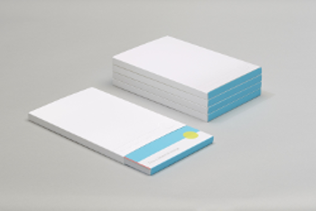

GWSMaterialUIKit
================

Since the gradle build system gets bogged down when we have
many libs(aars) and since I want to control the diamond dependency problem
the UI back ported libs have been combined into one UI library.

The main important feature of the is library is that it integrates with
how the android support internals work as far as Theme, Type, etc. It works
this way, the custom views we create are extensions of custom stuff in the
GWSMaterialUIKit library that extends views/widgets from the AppCompat
Android Support library stuff so that we get the benefits of tint, etc(hopefully,
android engineers adopt that pattern for other UI feature changes past api 24 as
that would make ti oh so much easier to deal with back ports).

In a start-up with a growing android team you want the UI base 3rd party
widgets combined into one internal library that your team contributes
to and controls as the main goal in the beginning of a start-up is to hose
out new features to somewhat bootstrap increasing the MAUs.

This is a temporary library when targeting stuff under api 21 and its
expected that when developers are focusing on targeting as minSDk api 21
or higher that this library will no longer be used.

# Senior Android Developer Note

A large part of the back-ported UI libraries by average android developers have
glaring mistakes in application of android framework and support library internals knowledge and other visual design problems. So I choose a base subset of those UI new feature back-ported libraries to clean up and use. The modifications and the best practices justifications are as follows:

1. As of Fall 2016 the Gradle Android Plugin combined with Gradle stills has performance problems with having to import large number of aars as library imports. Thus I am combining several UI back-ported libraries into one aar to address that problem.

2. ViewDecorator and several other custom widgets use custom font loading incorrectly forgetting that api 21 and under one has to use a TypefaceHelper to cache fonts loaded to avoid memory leaks. Thus, added a TypefaceHelper that gets set up as a Singleton once the first method is called to cache fonts loaded.

3. Complexion Reduction is a new visual trend that tweaks the application of Google Material Design to avoid using image headers and focus on content, spacing, fonts, and monochromatic color matching for branding. A full monochromatic Material Design color palette and spacing keylines res xml files are included.


# Usage

if library, describe how to download library using jitpack than describe how to use the library.

I use jitpack to upload my libraries so you put this in your root buildscript:

```groovy
allprojects {
        repositories {
            jcenter()
            maven { url "https://jitpack.io" }
        }
   }
```
Than in the module buildscript:


```groovy
compile 'com.github.shareme:GWSMaterialUIKit:{latest-release-number}@aar'
```

# Developed By


<a href="http://stackoverflow.com/users/237740/fred-grott">

</a>


Created by [Fred Grott](http://shareme.github.com).


# Credits

The following libraries were cleaned up and used in this project:

[Material developed by Rey Pham](https://github.com/rey5137/Material)

[ViewDecorator developed by ]()

[ViewAnimator developed by florent37, Inc. ie Florent Champigny](https://github.com/florent37/ViewAnimator)

[ToastCompat developed by Kamikat]()

[Material PagerSlidingTabStrip developed by Andreas Stuetz]()

[Android ObservableeScrollView developed by Soichiro Kashima  ](https://github.com/ksoichiro/Android-ObservableScrollView)

[MultiStateAnimation developed by KeepSafe Inc]()

[MaterialScrollBar developed by Wynne Plaga](https://github.com/krimin-killr21/MaterialScrollBar)

[RecyclerView-MultipleViewTypesAdapter developed by yqritc
](https://github.com/yqritc/RecyclerView-MultipleViewTypesAdapter)

[MaterialMenu developed by Balys Valentukevicius
](https://github.com/balysv/material-menu)


[Zdepth developed by Shogo Mizumoto]()


# Resources

Resources can be found at the [GWSTheWayOfAndroid wiki](http://github.com/shareme/GWSTheWayOfAndroid/wiki).


# License

Copyright (C) 2016 Fred Grott(aka shareme GrottWorkShop)

Licensed under the Apache License, Version 2.0 (the "License"); you
may not use this file except in compliance with the License. You may
obtain a copy of the License at

http://www.apache.org/licenses/LICENSE-2.0

Unless required by applicable law or agreed to in writing, software
distributed under the License is distributed on an
"AS IS" BASIS, WITHOUT WARRANTIES OR CONDITIONS OF ANY KIND,
either express or implied. See the License for the specific language
governing permissions and limitations under License.
